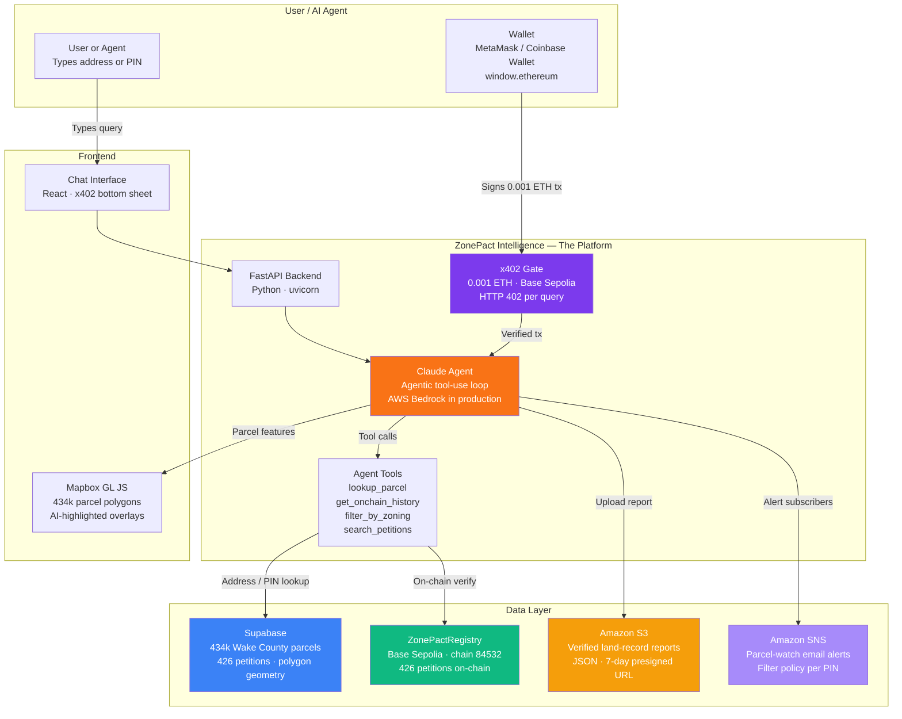
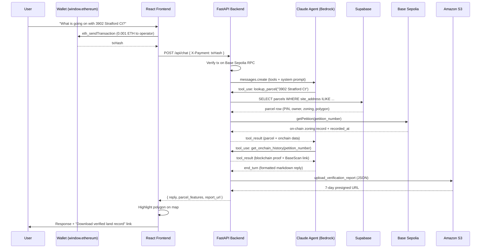
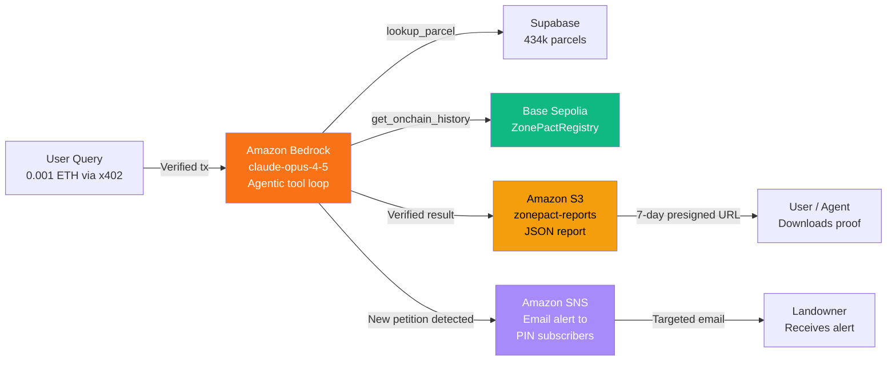

# ZonePact Intelligence

**Blockchain-verified land records for the AI economy** — Coinbase × AWS Agentic Hackathon 2025

ZonePact Intelligence is a pay-per-query AI agent that answers questions about rezoning petitions and land records in Wake County (Raleigh, NC) and Arlington, VA. Every verified lookup is stored as a tamper-proof record on Base Sepolia via the **ZonePactRegistry** smart contract — replacing the $5–8k consultant verification that DeFi lenders, real estate investors, and urban planners currently pay.

**Built for:** Coinbase × AWS Agentic Hackathon 2025

---

## The Problem

When a DeFi protocol like Aave or Centrifuge underwrites a real-world asset loan, they need to know: *is this parcel being rezoned?* An active rezoning petition can wipe 30–60% off land value overnight. Today, that verification costs $5–8k and takes 2–4 weeks through title companies and consultants.

ZonePact makes it a $0.001 AI query with cryptographic proof.

---

## How It Works



---

## Query Pipeline



---

## AWS Architecture



| AWS Service | Role | Fallback (local dev) |
|---|---|---|
| Amazon Bedrock | Claude inference — `anthropic.claude-opus-4-5` | Anthropic direct API |
| Amazon S3 | Verified land-record JSON reports — `zonepact-reports/` | `report_url` omitted |
| Amazon SNS | Parcel-watch email alerts — filter policy per PIN | Returns error (graceful) |

Check wired services at runtime: `GET /api/aws-status`

---

## Quick Start

```bash
# 1. Clone
git clone https://github.com/<your-username>/zonepact
cd zonepact

# 2. Backend
cd backend
pip install -r requirements.txt
cp .env.example .env          # fill in keys (see below)
uvicorn main:app --reload --port 8000

# 3. Frontend (new terminal)
cd frontend
npm install
cp .env.example .env          # fill in VITE_MAPBOX_TOKEN + VITE_ZONEPACT_EVM_ADDRESS
npm run dev                   # http://localhost:5174
```

### Backend `.env`

```env
# AI — pick one
ANTHROPIC_API_KEY=sk-ant-...

# AWS (activates Bedrock + S3 + SNS automatically when set)
AWS_ACCESS_KEY_ID=
AWS_SECRET_ACCESS_KEY=
AWS_DEFAULT_REGION=us-east-1
S3_BUCKET=zonepact-reports
SNS_TOPIC_ARN=

# Base Sepolia
ZONEPACT_EVM_ADDRESS=0x6b0f23e5F7E3AA33f4b7C47a2E6e94705A4461CE
BASE_SEPOLIA_RPC_URL=https://sepolia.base.org
MIN_PAYMENT_WEI=1000000000000000

# Supabase
SUPABASE_URL=https://...supabase.co
SUPABASE_KEY=sb_publishable_...

# ZonePactRegistry
REGISTRY_ADDRESS=0x82b5Bb6A1F76484C28b87d59c984656DA9aD04Bc

# Dev only
DISABLE_PAYMENT_GATE=false
```

### Frontend `.env`

```env
VITE_MAPBOX_TOKEN=pk.eyJ1...
VITE_ZONEPACT_EVM_ADDRESS=0x6b0f23e5F7E3AA33f4b7C47a2E6e94705A4461CE
VITE_DISABLE_PAYMENT_GATE=false
VITE_API_URL=http://localhost:8000
```

---

## Agent Tools

The Claude agent has five tools available per query:

| Tool | Description |
|---|---|
| `lookup_parcel` | Find a parcel by street address or PIN — returns owner, land use, area, value, active petition, and GeoJSON polygon |
| `get_onchain_history` | Verify a petition directly from ZonePactRegistry on Base Sepolia — returns contract proof + BaseScan link |
| `search_petitions` | Full-text search across petitions by address, petitioner, zoning code, or description |
| `filter_by_zoning` | Filter petitions by zoning category (commercial, multifamily, industrial, mixed-use, or specific code like C-2, R-5) |
| `get_county_stats` | Summary stats for a county — total petitions, status breakdown, top proposed zonings |

---

## API Routes

| Route | Method | Auth | Description |
|---|---|---|---|
| `/api/chat` | POST | x402 (0.001 ETH) | AI agent query — full agentic loop |
| `/api/parcels/geojson` | GET | None | Petition polygon overlays (Mapbox source) |
| `/api/watch` | POST | None | Subscribe email to SNS alerts for a PIN |
| `/api/aws-status` | GET | None | AWS service status — configured vs. active |
| `/health` | GET | None | Backend health check |

### Example: parcel lookup

```bash
curl -X POST http://localhost:8000/api/chat \
  -H "Content-Type: application/json" \
  -H 'X-Payment: {"txHash": "0xabc..."}' \
  -d '{"message": "What is going on with 3902 Stratford Ct?", "county_id": "raleigh_nc"}'
```

### Example: parcel watch

```bash
curl -X POST http://localhost:8000/api/watch \
  -H "Content-Type: application/json" \
  -d '{"email": "owner@example.com", "pin": "1705485362", "address": "3902 Stratford Ct"}'
```

---

## Tech Stack

| Layer | Choice | Why |
|---|---|---|
| Blockchain | Base Sepolia (EVM, chainId 84532) | Hackathon target chain — Coinbase |
| Smart Contract | Solidity 0.8.20 — `ZonePactRegistry.sol` | Stores 426 petitions as on-chain proof |
| AI Inference | Claude via AWS Bedrock (`anthropic.claude-opus-4-5`) | AWS bounty + agentic tool-use |
| AI Dev Fallback | Anthropic direct (`claude-opus-4-6`) | Works without AWS credentials |
| Report Storage | Amazon S3 — `zonepact-reports/` | Tamper-proof verified land records |
| Parcel Alerts | Amazon SNS — filter policy per PIN | Targeted landowner notifications |
| Payments | x402 protocol — 0.001 ETH per query | HTTP 402 micropayment on Base Sepolia |
| Wallet | Raw `window.ethereum` — MetaMask / Coinbase Wallet | Zero extra dependencies |
| Database | Supabase (PostgreSQL) | 434k Wake County parcels + 426 petitions |
| Maps | Mapbox GL JS — Mapbox vector tilesets | 434k parcel polygons rendered client-side |
| Backend | Python FastAPI + uvicorn | Agentic loop, x402 gate, AWS wiring |
| Frontend | React 18 + Vite + Tailwind CSS | Intel chat + map UI |

---

## ZonePactRegistry Contract

```
Network:   Base Sepolia (chain ID 84532)
Address:   0x82b5Bb6A1F76484C28b87d59c984656DA9aD04Bc
Explorer:  https://sepolia.basescan.org/address/0x82b5Bb6A1F76484C28b87d59c984656DA9aD04Bc
```

| Function | Description |
|---|---|
| `getPetition(petitionNumber)` | Full zoning record for a petition — present zoning, proposed zoning, vote result, recorded_at |
| `getFullHistory(pin)` | All petitions ever filed for a parcel PIN |
| `totalPetitions()` | Total records on-chain (currently 426) |

426 Wake County rezoning petitions are recorded on-chain — each with petitioner, zoning change, status, vote result, and UNIX timestamp.

---

## Repo Structure

```
zonepact/
├── frontend/                    # React + Vite + Mapbox GL JS
│   └── src/
│       ├── pages/
│       │   ├── Landing.jsx      # Hackathon landing page
│       │   ├── IntelPage.jsx    # Map + AI chat (main product)
│       │   └── MapPage.jsx      # Standalone map explorer
│       ├── components/
│       │   └── ChatInterface.jsx  # x402 gate + wallet + messages
│       ├── hooks/
│       │   └── useWallet.js     # Raw window.ethereum hook (no wagmi)
│       └── services/
│           └── api.js           # chatWithAgent — X-Payment header
│
├── backend/                     # FastAPI Python
│   ├── main.py                  # App + CORS + /api/aws-status
│   ├── aws_services.py          # Bedrock · S3 · SNS integrations
│   └── routes/
│       ├── chat.py              # /api/chat — agentic loop + x402 gate
│       └── parcels.py          # /api/parcels/geojson + /api/watch
│
├── contracts/                   # Solidity (already deployed)
│   ├── ZonePactRegistry.sol     # 426 petitions on Base Sepolia
│   └── ZonePactOracle.sol
│
├── scraper/                     # Python — Arlington VA OnBase scraper
│   └── scraper.py
│
└── data/
    ├── petitions.json           # Arlington VA — 18 petitions (local)
    └── raleigh_petitions.json   # Raleigh NC fallback (Supabase primary)
```

---

## Hackathon Requirements

| Requirement | Implementation |
|---|---|
| **Coinbase — Base Sepolia** | ZonePactRegistry deployed on Base Sepolia (84532) — 426 petitions on-chain |
| **Coinbase — x402 Protocol** | HTTP 402 gate on `/api/chat` — 0.001 ETH per AI query, verified on-chain before every response |
| **Coinbase — Wallet integration** | Raw `window.ethereum` — `eth_requestAccounts`, `wallet_switchEthereumChain`, `eth_sendTransaction` |
| **AWS — Amazon Bedrock** | Claude runs via `AnthropicBedrock` client when `AWS_ACCESS_KEY_ID` is set — graceful fallback to Anthropic direct |
| **AWS — Amazon S3** | Verified land-record JSON uploaded to `zonepact-reports/` after each `lookup_parcel` call with on-chain data |
| **AWS — Amazon SNS** | `POST /api/watch` subscribes landowners to per-PIN email alerts via SNS filter policy |

---

## Use Cases

**DeFi Lenders (Aave, Centrifuge, Goldfinch)**
Before underwriting a real-world asset loan against land, verify the parcel's zoning status on-chain in one $0.001 query instead of a $5–8k title report.

**Real Estate Investors**
Check whether a target property is under active rezoning — and get cryptographic proof of the current zoning state at the time of due diligence.

**Urban Planners & Civic Tech**
Map all active commercial or multifamily rezoning petitions across a county, filtered by zoning type and status, in real time.

---

**Built for the Coinbase × AWS Agentic Hackathon 2025**  
Stack: Claude · AWS Bedrock · Base Sepolia · x402 · Supabase · Mapbox
